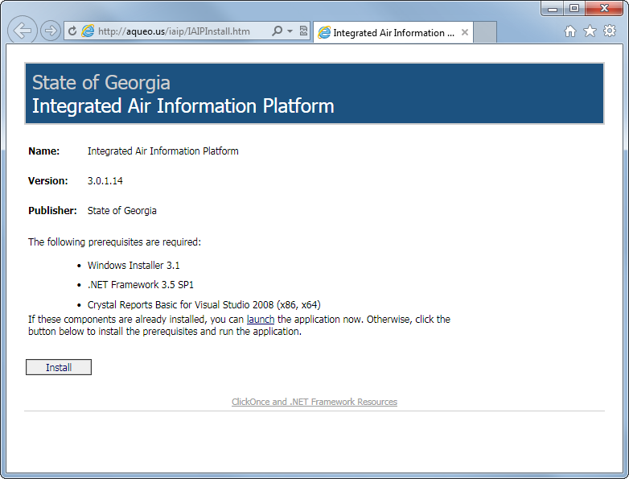

% IAIP <i>Installation Instructions</i>

<.aside>

## <abbr title="Too long; didn't read">TL;DR</abbr>

Go to the [Installation Page](#), click the `Install` button, and follow the prompts.

<./aside>

## Introduction

In February 2014, we will be changing the method used to distribute and update the IAIP.

### The Good News:

Installation will be just as easy as before (easier in most cases!) and will not require Administrator access to the computer. Updates will be easier for us to release, smaller for you to download, and easier to install.

### The Bad News:

Switching to the new system will require all current users of the IAIP to manually install the new version from scratch. Luckily, this is a one-time process, and after that updates will be automatic.

## How to Install

1. 

    Go to the [Installation Page](#) and click the `Install` button.

2. Try not to fall down.

1. 

    Go to the [Installation Page](#) and click the `Install` button.

## Then end

+ Test list
+ Item 2

- Test list two
- Item 2? 4?
