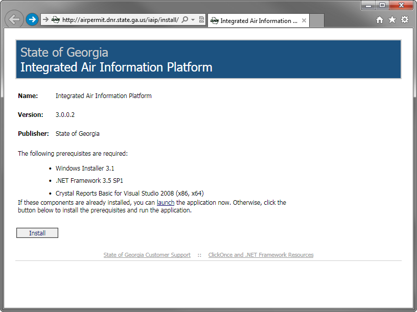

% IAIP Installation Instructions

<aside>

## Short Summary

Go to the [Installation Page](#), click the `Install` button, and follow the prompts.

</aside>

## Introduction

In March 2014, we will be changing the method used to distribute and update the <abbr title="Integrated Air Information Platform">IAIP</abbr>.

### The Good News:

Installation will be just as easy as before (easier in most cases!), and future updates will be smaller to download and will install automatically.

### The Bad News:

Switching to the new system will require all current users of the IAIP to manually install the new version from scratch. Luckily, this is a <em>one-time process</em>, and after that, updates will be automatic.

## How to Install

1. 

    Go to the [Installation Page](#) and click the `Install` button.

2. Try not to fall down.

1. 

    Go to the [Installation Page](#) and click the `Install` button.
	
1. The new IAIP will try to delete your old shortcuts, but if it can't, feel free to delete them yourself. 

## Then end

+ Test list
+ Item 2

- Test list two
- Item 2? 4?
