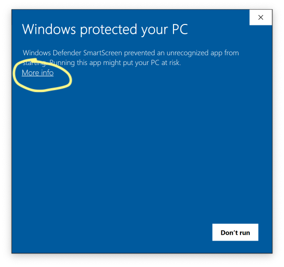
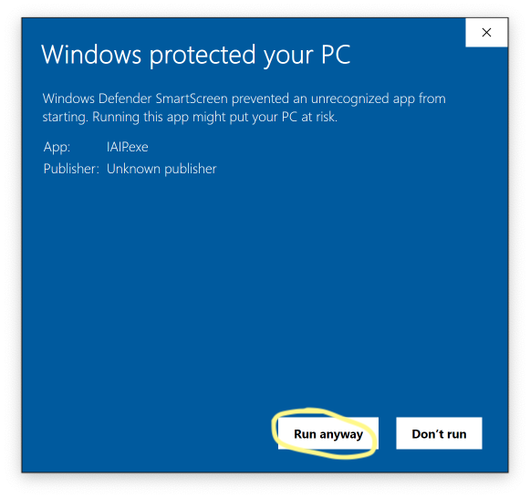
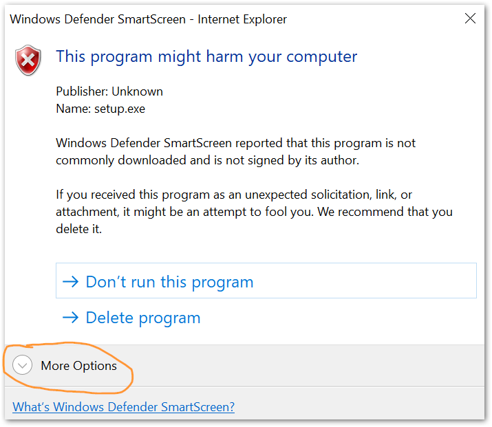
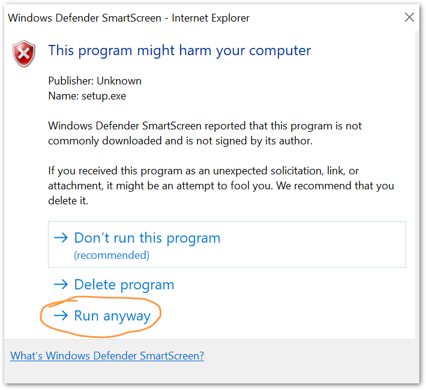

% Integrated Air Information Platform

The IAIP is used by the [Georgia Environmental Protection Division](https://epd.georgia.gov) to collect and organize data required by the [Air Protection Branch](https://epd.georgia.gov/air-protection-branch).

## Support

For account management and general application support, please contact your supervisor in EPD or Sean Taylor in the Air Branch. To report an error or bug, please create an EPD-IT Support Ticket.

## Installation

Click this button to download and run the setup file.

[Download the
IAIP Installer](install/IAIP.application)

The installer does **not** require admin permissions. You will likely get one or more security alerts such as those shown below when you run the installer. Click the "More info" or "More options" link, then click the button labeled "Run anyway".

 

 

## Using the IAIP

The IAIP may *only* be used while connected to the DNR GlobalProtect VPN. This applies while located within an EPD office or when working remotely.

Your username and password for the IAIP are not the same as your SOG login.

## What's New

See the [change log](changelog/).

## License

The IAIP is Copyright © State of Georgia. This product is licensed for use only by employees of the State of Georgia.

Source code for the IAIP and this website are available on [GitHub](https://github.com/gaepdit/iaip).
