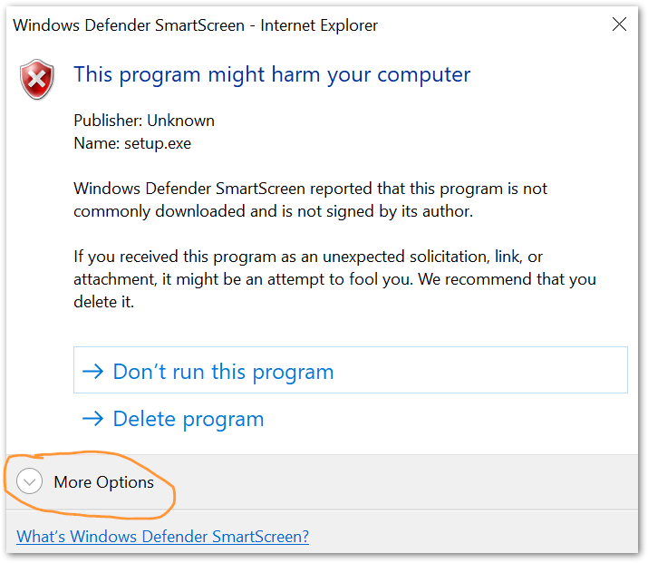
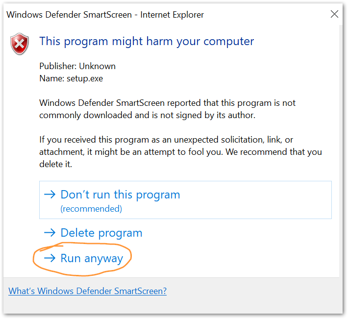

% Integrated Air Information Platform

The IAIP was developed by the Georgia EPD to collect and organize data required to operate an efficient air quality program. IAIP development began in 2004 and is ongoing.

## Installation

Click the button to download and run the setup file.

[Download the
IAIP Installer](install/IAIP.application)

## Support

For account creation or management, please speak to your supervisor in EPD or Sean Taylor. For general application support or to report a bug, please create an EPD-IT Support Ticket.

Some additional documentation can be found on the [IAIP Documentation site](https://sites.google.com/site/iaipdocs/).

## Printing

If this is the first time the IAIP is being installed on your computer, you may also need to install the [IAIP Tools](../pre-install/) to enable printing.

## Connecting remotely

The IAIP may be used from remote locations (outside of EPD offices) *only* by connecting through the DNR VPN. [Instructions for accessing the VPN](https://dnrintranet.org/it/SSLvpn) are available on the DNR Intranet.

Your username and password for the VPN are the same as the ones you use to log in to your work computer (not the same as your IAIP username/password).

## Security alert

You will likely get one or more security alerts such as those shown below when you install the IAIP. Click the "More info" or "More options" link, then click the button labeled "Run anyway".

 

 

## What's New

See the [change log](changelog/).

## License

The IAIP is Copyright © Georgia Air Protection Branch. This product is licensed only to employees of the State of Georgia.
